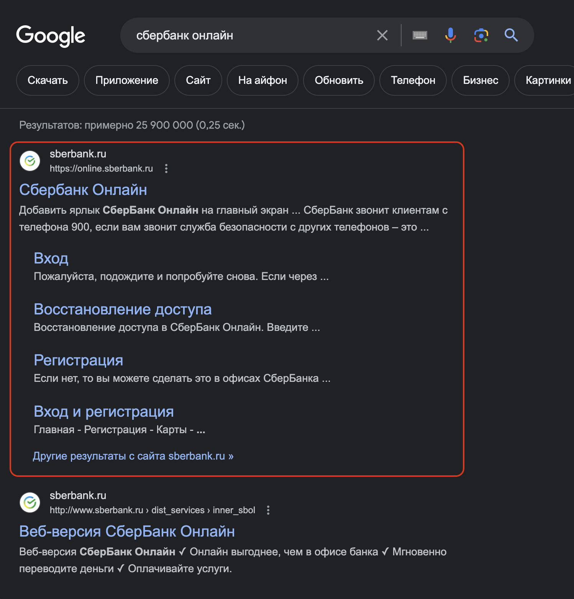

# Знакомство с веб-технологиями.

## Семинар 1. Веб-технологии: вчера, сегодня, завтра

 

### Чем веб-приложения отличаются от веб-сайтов?

 
Веб-приложения сложнее: админки, возможность отправки сообщений, создания постов, возможность загружать видео и фотографии, возможность авторизации и регистрации и прочее.
Веб-сайты - просто страницы: текст+картинки  
 

### IP-адрес

уникальный числовой идентификатор устройства в сети, работающего по протоколу IP.
Бывают 2-х версий: **v4** и **v6**.
Изначально была версия **v4**, вот она:

> 23.0.123.255  

числа - **от 0 до 255**. Этих адресов стало не хватать, сделали версию **v6**:

> 2001 : 0db8 : 11a3 : 09d7 : 1f23 : 8a2e : 07a0 : 765d  

IP-адреса могут быть **динамические** и **статические**, например интернет провайдер предоставляет динамические IP-адреса, закупает условно 1000адресов и присваивает действующим пользователям, адрес пользователя, который перестал пользоваться услугами интернет провайдера передается другому пользователю. Или если пользователь не онлайн - его адрес также передается другому, который онлайн. Это делается автоматически маршрутизаторами.  
 
23.0.123.255:8080 - где **:8080** - это **порт** для _передачи данных конкретной программе_, работающей на компьютере.
На компьютере может быть запущен ряд программ, каждая программа выбирает порт, по которому она будет "общаться". Когда данные придут в конкретный порт - программа их обработает (если данные придут в другой порт - программа их НЕ обработает - экономия процессорного времени).  
 

### Порты для сайтов:

23.0.123.255:**80** - **http**  
23.0.123.255:**443** - **https**  
Сайт можно "повесить" на любой порт. Если "повесить" на нестандартный (не :80, не :443) - придется прописывать в адресной строке, прим: https//site.ru:8080, эти цифры никто не запоминает, поэтому всегда "вешают" на 80 или 443  
 

### Принцип открытия сайта:

введение в поисковую строку _доменного имени_ сайта != IP-адреса сайта  
https//site.ru (протокол **https** + доменное имя **site.ru**)  
me -------------> DNS (чтобы узнать адрес сайта, браузер обращается на DNS-сервера)  
me <------------- DNS (DNS-сервер ответом присылает IP-адрес).  

me -------------> server (браузер делает запрос непосредственно на нужный сайт (по IP-адресу) и обращается к **серверу** сайта)  
me <------------- server (сервер возвращает html страницы) /

браузер принимает html страницу сайта, начинает парсить (разбирать на теги) и создавать страницу в том виде, в котором она отображается. Когда все подгрудается (разметка, стили, код, картинки, шрифты - css, js, img, fonts).  
 

### dev tools, development tools

f12 - открыть **отладчик** на странице сайта (или правая кнопка по странице сайта - > посмотреть код).  
 
вкладка **Elements** - где какие эл-ты на странице находятся, сколько места занимают, какие есть отступы, что именно находится в этих элементах (нажать на кнопку стрелки в пунктирном квадрате  - можно поэлементно выбирать на странице нужные блоки - соответствующий код будет подсвечен). Необходимо при верстке (наполнении) сайта.  
 
вкладка **Console** - сообщения об ошибках.  
 
вкладка **Sources** - все ресурсы, которые загружались - картинки, шрифты.  
 
вкладка **Network** - все, что загружалось - html, картинки ,шрифты и тп. Вкладка **Headers** первой строкой можно увидеть протокол в **Request URL** - http или https и **Remote Adress** - цифрами. В **Request URL** после доменного имени будет прописан ряд символов юникод - тк \_нельзя передавать ничего, кроме английских символов - все остальное будет преобразовываться в символы юникод.  
 
вкладка **Security** - сообщения об ошибках.  
 
Зачем нужно шифрование http**s**
me -------------> server  
общение с сервером имеет проблему - **MITM** (man in the middle - человек посередине) - MITM может увидеть и прослушать все, что отправляем мы и что отправляют нам (email, лог-пароль, данные карт и тд), если протокл - http. Поэтому сайтов, работающих на http очень мало - это опасно. По данному протоколу как минимум провайдер и силовые структуры могут беспрепятственно считать пересылаемые данные.  
me <-------MITM------> server  
В случае работы на https даже если в самом начале общения с сервером есть MITM, все равно можно организовать взаимодействие так, что данные будут зашифрованы для MITM.  
 
Как сделать из http https?  
При общении с сервером, на сервере есть программа nginx/patch/traffic/kadin, которая принимает все запросы, в зависимости от того, как прописаны ее настройки - она делает какие то действия (передает другой программе, просто читает данные, возвращает). Имено эта программа отвечает за соединение нас и веб-сервера - здесь и нужно будет прописать, чтобы она работала по протоколу https и дать ей ключи шифрования (ключи шифрования могут быть созданы разработчиком самостоятельно - одной командой в терминале). Однако браузеры не будут доверять этим ключам - будет выведено предупреждение, что сайт ненадежен. Чтобы браузер доверял сайту с созданными разработчиком ключами, помимо самих ключей нужны сертификаты (на замочке  в адресной строке -> безопасное подключение -> действительный сертификат).  
Сертификат можно купить, можно получить бесплатно на сайте https://letsencrypt.org/ru/ на 3 месяца, через 3 месяца придется обновлять (также бесплатно). На сайте есть документация, в которой прописаны все шаги. Либо запрос "letsencrypt настроить сертификацию для сайта". Можно настроить скриптом автообновление.  
Если знать как делать - процесс смены с http на https займет порядка 15 минут.  
 

### Поисковые системы - поисковики

**Поисковая выдача** - все те результаты, которые появляются после набора запроса в поисковой строке.  
Одна ссылка на конкретный результат поиска - это **поисковой симбиот**   
 
Как они работают?  

- Первая стадия - сбор всей информации (кода) с сайтов (веб скрабберами/поисковыми роботами)  
- Вторая - анализ собранного и оценка сайта- когда этот сайт нужно показывать: что на сайте есть, что сайт предоставляет/продает, ключевые слова, посещаемость сайта и тп.
- Третья - уже после ввода пользователем - подбирает сайты, которые подходят под запрос: смотрит локацию пользователя и выдает подходящие результаты, какие сайты посещались ранее, какое время года, время дня/ночи и проч. Первые строки - сайты, которые существуют годами.  
   

Также есть рекламные сообщения, сверху и снизу страницы поисковой выдачи - сбоку от поискового симбиота подпись "реклама". Рекламируются сайты, оплатившие рекламу своих сайтов поисковику.  
 
За _клик_ пользователя по сайту, выданного в поисковой выдаче, сайт оплатит поисковику установленую сумму (поисковики на этом зарабатывают, при этом поисковик не гарантирует качество сайта или качество товара/услуги, размещенного на нем). Поэтому очень важно настраивать правильно рекламу на нужные поисковые запросы. Таргетолог настраивает рекламу на ЦА, чтобы не сливать бюджет.
SEO-специалисты занимаются тем, чтобы поправить сайты, чтобы чаще сайт появлялся в поисковой выдаче.  
 

### Всегда проверять доменное имя перед покупкой его для сайта - https://web.archive.org/ - посмотреть по годам что было на этом сайте, чтобы не попасть в черный список (категория для взрослых, казино и тп.) - никода более ни один поисковик не поднимат в топы поисковой выдачи.

 

### Структура сайтов - "шапка" (хедер), основной контент, футер ("подвал").

Хедер и футер не меняются от страницы к странице.

Заменить картинку - параметр "srcset"